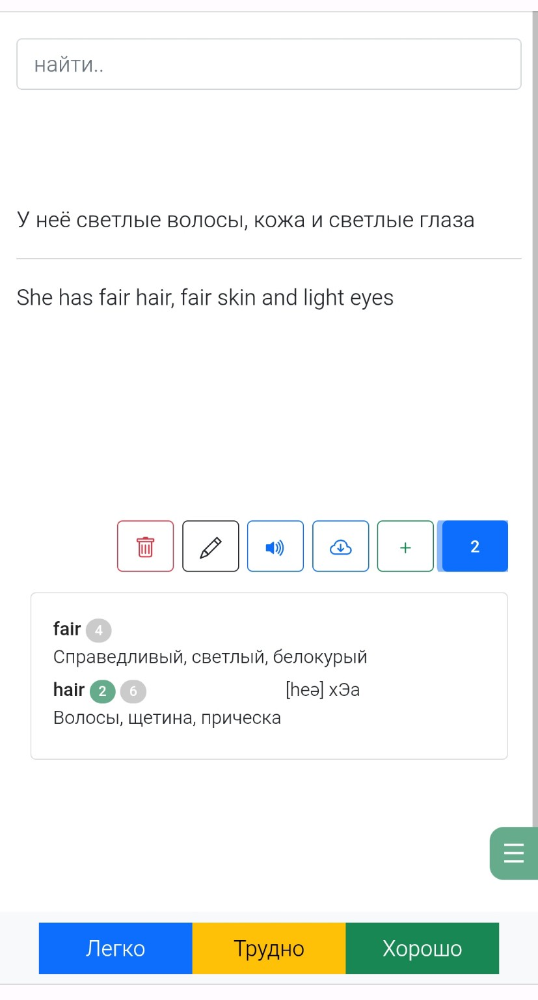
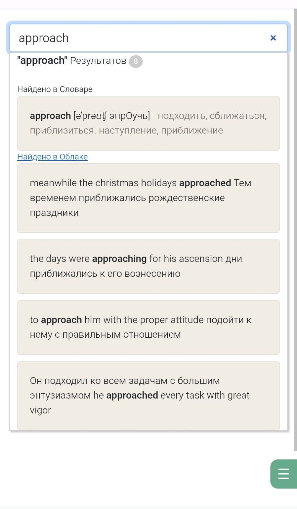
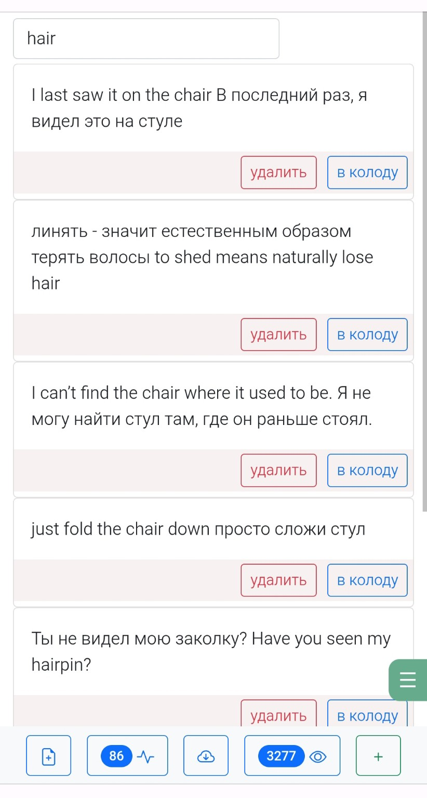
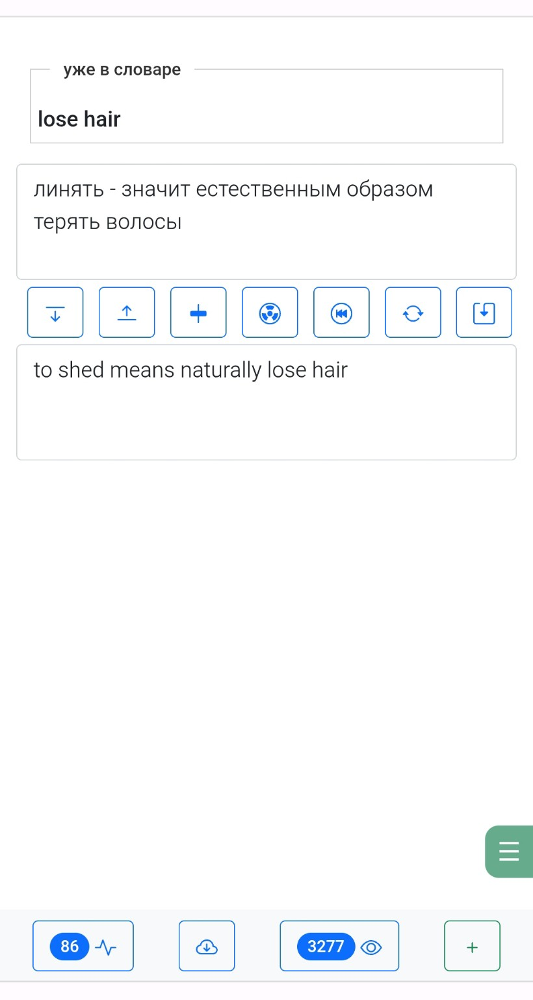
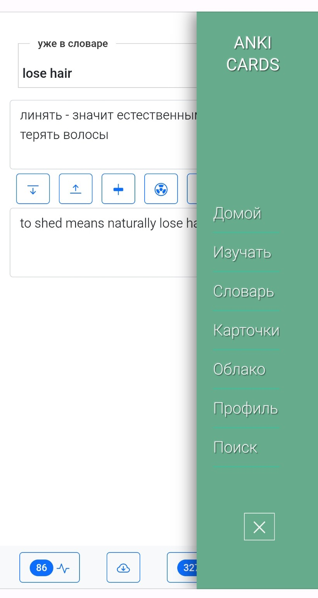
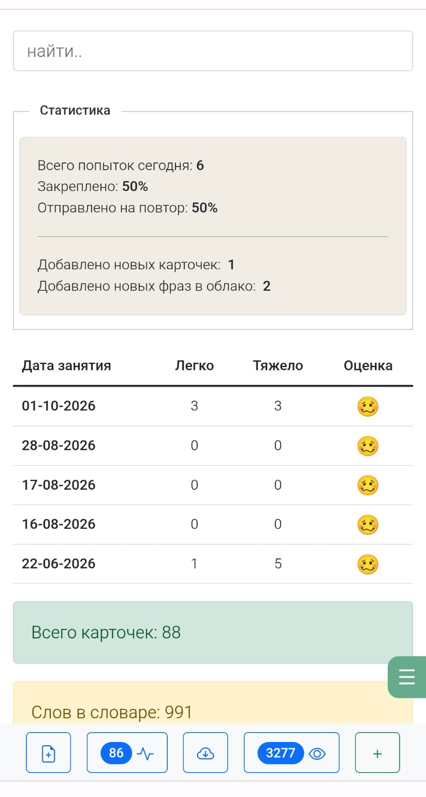

# Context-Based Language Learning App

A personal, mobile-first language-learning application built around one idea: **a word is easier to remember when you can see where else you've already encountered it.**

Instead of studying isolated `word -> translation` pairs, the app keeps three parts of the learning workflow connected:

- a personal dictionary,
- an active study deck,
- and a lightweight phrase inbox called **Cloud**.

The same word can be traced across all three.



## Highlights

- **Context-first vocabulary learning** — see where a word already appears across cards, dictionary entries, and saved phrases.
- **Capture now, organize later** — save useful phrases quickly, then turn them into structured cards when convenient.
- **One-handed mobile workflow** — the interface was designed around real phone use during a commute.
- **Custom scheduling logic** — a lightweight interval-based review system built specifically for this project.
- **Built from scratch in PHP** — including a small custom MVC layer, routing, and the core application logic.

## Why I built it

I started this as a personal project because plain flashcards did not match how I actually learn vocabulary.

Knowing a translation is not the same as knowing how a word is used, and a word studied in isolation is easier to forget than one you keep recognizing across different phrases and situations.

So the application grew around **phrases and context**, not just word/translation pairs.

It also grew the way many personal tools do: I used it, ran into something inconvenient, asked what was missing or what could be made faster, implemented a change, and kept using it.

There was never a fixed product specification. The development loop was closer to:

`use -> notice friction -> improve -> use again`

That iterative process shaped most of the features described below.

## Contextual vocabulary model

The core of the app is three interconnected stores of learning material:

- **Dictionary** — words explicitly added for study, with pronunciation and meaning.
- **Active cards** — front/back phrases currently in the learning deck.
- **Cloud / Learning Inbox** — phrases captured for later and not yet turned into cards.

A word is not tied to only one of these places.

The same word can exist in the dictionary, appear inside several active cards, and also occur in phrases still waiting in the inbox.

The system is built around one recurring question:

> **Where else have I already seen this word?**

## Context while studying

While studying a card, the app checks its text against the dictionary and shows which known words occur in the current phrase.

For each matched word, the study screen can show separate indicators for:

- occurrences in active cards,
- occurrences in saved Cloud phrases.

From there, I can preview related phrases without leaving the study screen, open the full Cloud list already filtered to that word, and turn one of those saved phrases into another card.

The workflow is approximately:

`current card -> word -> related contexts -> filtered Cloud -> new card`

This keeps vocabulary connected instead of treating every card as an isolated learning unit.

## Contextual search

A global search looks across the **Dictionary**, **Active Cards**, and **Cloud** at the same time. Each source can also be enabled or disabled in user settings.

Search is intentionally simple and substring-based rather than fuzzy or semantic.

Because short or common words can create false-positive substring matches, individual dictionary entries can be marked for stricter matching so they are treated more like whole words.



## Cloud / Learning Inbox

The Cloud is a deliberately low-friction capture tool.

> In this project, **Cloud** is simply the name of the learning inbox inside the application. It is not a cloud-storage or cloud-computing service.

When I encountered a useful phrase, I did not always want to stop and build a full card immediately. I wanted to save it quickly and process it later.

For example:

```text
hello world
привет мир
```

Later, from the Cloud list, a saved phrase can be promoted into a card.

If the phrase contains two lines, the app automatically places them into the front/back fields. If the sides are reversed, they can be swapped with one action.

The original Cloud entry is only removed after the new card is actually saved, so abandoning card creation does not destroy the captured phrase.

The workflow is:

`capture now -> process later -> inspect context -> add to deck`





## Mobile-first by necessity

This is technically a web application, but it was designed primarily for use on a phone.

A conventional desktop layout was never the goal.

I used the application during a daily commute, often standing on public transportation with the phone in one hand and the other hand holding a rail. That made one-handed interaction and minimal tapping much more important to me than making the interface fill a desktop monitor.

That constraint is visible in the implementation:

- the main workspace remains roughly phone-width even on large screens;
- the layout includes special handling for very small screens;
- primary navigation is kept at the bottom within thumb reach;
- the card editor places common actions directly between the two card fields;
- front/back content can be moved, reversed, or reorganized without navigating through menus.

The desktop appearance should therefore be read as a **phone-oriented workspace displayed inside a larger browser window**, not as an unfinished desktop layout.



## Card scheduling

The application uses a custom, lightweight interval-based scheduling model.

Cards can come from:

- a short-term waiting list for cards scheduled to return soon;
- the main queue of cards whose next review time has arrived.

Answering a card changes its next interval.

The current study UI exposes three responses:

- **Easy**
- **Hard**
- **Well**

A fourth response, **Repeat**, also exists in the scheduling code but is not currently exposed as a visible study button.

The scheduling model was written specifically for this project. It is **not** an implementation of SM-2 and is not intended to reproduce Anki's scheduling algorithm.

## Learning statistics

The dashboard shows recent study activity, including:

- today's attempts,
- the split between easier and harder answers,
- newly added cards,
- newly captured Cloud phrases,
- newly added dictionary words,
- recent learning history.

Each day also receives a simple relative rating.

The rating is not based on a universal daily target. The implementation compares activity with the learner's own historical best-day values, making the question more personal:

> **How does today's activity compare with my own previous performance?**



## Additional features

A few smaller features support the core workflow:

- **Duplicate-card detection** — finds cards with identical front or back content and provides a review screen.
- **Text-to-speech** — optional read-aloud support for card text.
- **Per-word strict matching** — reduces false positives for words that are problematic with normal substring search.
- **Grammar / rules reference** — a small place for language notes I wanted to keep accessible.

Some secondary experimental screens were started during the life of the project but were never part of the core language-learning workflow.

## Technical architecture

The application was built from scratch without a full-stack PHP framework.

I wrote a small custom MVC layer for routing, controllers, views, and common application behavior, while using a few focused third-party libraries where useful.

### Backend

- PHP / Object-Oriented PHP
- Custom MVC micro-framework
- Custom routing
- MySQL / MariaDB
- RedBeanPHP
- Session-based authentication
- Custom card scheduling logic

The project-owned framework code currently lives under:

```text
vendor/fw/
```

Despite that directory name, `vendor/fw/` is **my own application/framework code**, not a third-party Composer dependency.

### Frontend

- Server-rendered PHP views
- HTML / CSS / JavaScript
- jQuery
- AJAX
- Bootstrap

## Project history

This started as a private personal project with no public audience in mind.

The original application was designed, implemented, debugged, and evolved manually, before modern AI coding assistants became part of everyday software development.

Its features emerged gradually through actual daily use rather than from a prewritten feature list.

The repository was later cleaned specifically for portfolio review. That cleanup focused on:

- removing exposed credentials and local-only data;
- removing obsolete debug/development artifacts;
- fixing confirmed bugs;
- translating useful developer comments into English;
- preserving the original architecture and product behavior.

The goal of the cleanup was **to make the original work safe and understandable to review, not to rewrite it into a different project**.

## Running locally

### Requirements

- **PHP 8.2 (tested)**
- Composer
- MySQL or MariaDB

### Setup

```bash
composer install

cp app/config/config_db.php.example app/config/config_db.php
```

Configure your local database either in `app/config/config_db.php` or through the environment variables documented in the example configuration.

Create an empty local database. RedBeanPHP runs in fluid mode in this project and creates the required tables/columns as the application writes data.

For local development with PHP's built-in server:

```bash
php -S 127.0.0.1:8001 -t . dev-router.php
```

Then open:

```text
http://127.0.0.1:8001
```

The development router exists because the original application was written to run behind Apache and `.htaccess` rewriting.

## Current status

This remains a personal historical project rather than a maintained public product, and there is currently no hosted demo.

The interface is intentionally phone-oriented rather than desktop-first.

Some secondary experimental screens were left unfinished, but the core workflow — **Dictionary, Cards, Cloud, contextual search, card scheduling, and statistics** — works end to end.

## What this project represents

For me, this project is useful as a portfolio piece not because it is a modern framework demo, but because it shows a complete cycle of building software around a real personal need:

`problem -> idea -> implementation -> daily use -> friction -> iteration`

It also represents the way I worked before AI-assisted development: the original application logic and product decisions were worked out and implemented manually, feature by feature, through direct use of the system.
